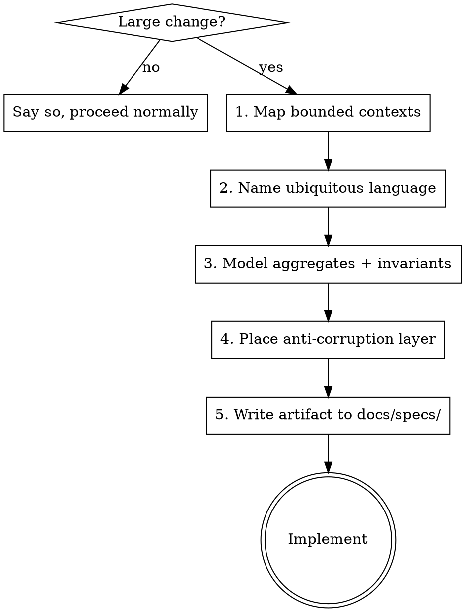

# Domain-Driven Design

## Overview

Large changes are where unexamined coupling and vendor lock-in calcify. DDD makes the boundaries and the domain model explicit *before* code, so the design survives the next dependency swap or scope expansion.

**Core principle:** model the domain first, name the boundaries, keep each context's types free of leaked implementation or vendor types, and translate at the edge. Produce a written artifact before implementation.

This is a discipline skill. The steps are not optional decoration on top of "just write the adapter." Arriving at a reasonable structure without naming the contexts, the language, and the invariants leaves the next person (and the next dependency swap) to rediscover them.

## When to use

Apply DDD when the change is **large**:

- A new subsystem or service.
- An architectural shift (changing how modules relate, splitting or merging packages).
- Encapsulating, wrapping, or replacing an external dependency (a payment provider, a vendor SDK, a third-party API).
- Restructuring data ownership across modules.

Symptoms that you're already in DDD territory:

- Vendor or implementation types (`stripe.Charge`, `sql.DB`, `s3.Client`) appear in signatures or struct fields across more than one module.
- The same word ("order", "stock", "account") means different things in different parts of the code.
- A single change forces edits across several otherwise-unrelated packages.

**Skip it** for bugfixes, a single function, a config tweak, or any change you can hold in one file. Say so explicitly when you skip: "small, localized change, no DDD modeling needed."

## The workflow

Work these in order. Do not jump to code until the artifact exists.



### 1. Map bounded contexts

Name each context and its responsibility. Draw the relationships: which is upstream/downstream, customer/supplier, conformist, or shielded by an anti-corruption layer. Use the `templates/context-map.md` template.

### 2. Name the ubiquitous language

List the domain terms each context owns. Flag terms that mean different things in different contexts — that ambiguity is usually the source of the tangle. State which values are *stored* and which are *derived* (storing a derived value is how numbers drift).

### 3. Model aggregates and invariants

For each aggregate: what is the consistency boundary, and what rules must *always* hold (e.g. `reserved <= on_hand`). Put every operation that can break an invariant *inside* the aggregate so the rule is enforced in one place, never scattered across callers.

### 4. Place the anti-corruption layer

When wrapping or replacing a dependency, define the boundary that keeps vendor/implementation types out of the domain. The domain defines an interface in its own types; the adapter translates. See `templates/anti-corruption-layer.md` for a Go skeleton and checklist.

### 5. Write the artifact before code

Produce a short ADR plus the context map in `docs/specs/` (or wherever the project already keeps specs — never a tool-named folder). Use `templates/adr.md`. Then implement.

## One concrete example (Go)

Domain owns a provider-neutral type and the interface. The vendor SDK is confined to one adapter package and never leaks.

```go
// package billing — the domain. No vendor types here.
type Money struct {
    Minor    int64  // amount in minor units; never float
    Currency string
}

type Charge struct {
    ID     string
    Amount Money
    Status ChargeStatus
}

// PaymentProvider is expressed entirely in domain types.
// Stripe and Adyen each become one implementation.
type PaymentProvider interface {
    CreateCharge(ctx context.Context, req ChargeRequest) (Charge, error)
    Refund(ctx context.Context, chargeID string) error
    VerifyWebhook(payload []byte, sig string) (Event, error)
}
```

```go
// package billing/stripe — the anti-corruption layer.
// The ONLY package allowed to import stripe-go. Deleted when Stripe is gone.
type Provider struct{ client *stripe.Client }

func (p *Provider) CreateCharge(ctx context.Context, req billing.ChargeRequest) (billing.Charge, error) {
    sc, err := p.client.Charges.New(toStripeParams(req)) // translate IN
    if err != nil {
        return billing.Charge{}, mapStripeErr(err)       // translate errors too
    }
    return toDomainCharge(sc), nil                        // translate OUT
}
```

Order, subscription, and reporting code import `billing` only — never `billing/stripe`. After the boundary exists, `grep stripe.` returns hits only inside the adapter.

## Common mistakes

| Mistake | Fix |
|---------|-----|
| "I'll just write the adapter" — skips contexts/language/invariants | The adapter is step 4 of 5. Name the contexts and invariants first or the boundary is in the wrong place. |
| Vendor types in domain signatures | Domain interface uses domain types only. Translate in the adapter. |
| Storing a derived value (e.g. `available`) | Store the inputs (`on_hand`, `reserved`), compute the derived value. |
| Invariant checks scattered across callers | Move them inside the aggregate. One enforcement point. |
| Big-bang swap of code + data + dependency at once | Phase it: introduce the boundary keeping the old impl, then swap behind it, then decommission. |
| Spec written under a tool-named folder | Artifacts go in `docs/specs/`, named by content, not by tool. |

## Red flags — stop and model first

- About to add a vendor type to a function signature outside its adapter package.
- About to start a large change by editing implementation directly.
- "This is obviously just X" for a change that spans multiple modules.
- Reaching for "skip the ceremony" on a new subsystem or dependency swap.

All of these mean: run the five steps and write the artifact first.

## Reference

`references/building-blocks.md` — entity vs value object, aggregate, repository, domain event, ACL, context-mapping relationship types. Read it when you need the vocabulary precisely.
