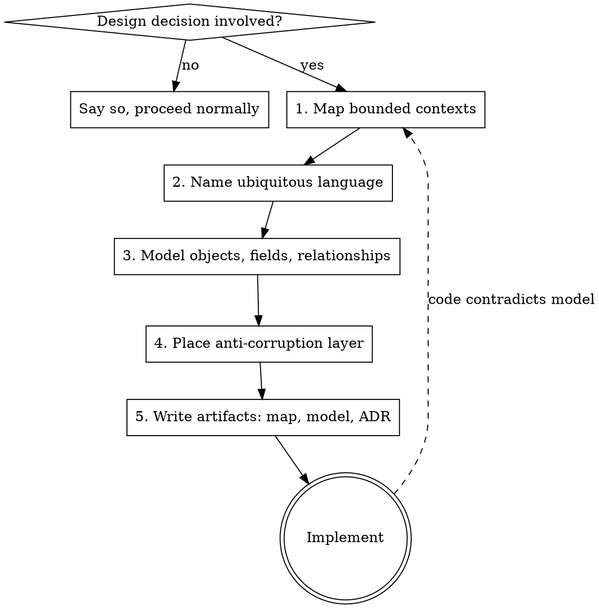

# Domain-Driven Design

## Overview

Design sessions are where unexamined coupling, anemic models and vendor lock-in calcify — the large ones and the small ones alike. DDD makes the boundaries and the domain model explicit *before* code, so the design survives the next dependency swap or scope expansion.

**Core principle:** model the domain first, name the boundaries at the size of whole models rather than responsibilities, classify every domain object (entity, value object or enumeration), give every object all of its fields and every relationship a cardinality in one self-contained section, enforce each aggregate's invariants at construction and mutation, keep each context's types free of leaked implementation or vendor types, and translate at the edge. Contexts sized by language, modeling effort concentrated on the core domain, every object earning its keep by making a concept explicit. Produce written artifacts — context map, domain model, ADR — before implementation.

This is a discipline skill. The steps are not optional decoration on top of "just write the adapter." Arriving at a reasonable structure without naming the contexts, the language, and the invariants leaves the next person (and the next dependency swap) to rediscover them.

## When to use

Apply DDD to **every architecture or design session, no matter how small**. If the shape of the code is being decided, the skill is on:

- Designing a new feature, subsystem, or service.
- An architectural shift (changing how modules relate, splitting or merging packages).
- Encapsulating, wrapping, or replacing an external dependency (a payment provider, a vendor SDK, a third-party API).
- Restructuring data ownership across modules.
- Any design discussion where types, boundaries, or responsibilities get chosen — even one small type.

The **only opt-out is the user saying so** ("no DDD", "skip the modeling"). Never self-exempt because the change feels small; small designs are where anemic models slip in. Scale the artifact to the change — a small design gets a short artifact, not a skipped one.

Symptoms that you're already in DDD territory:

- Vendor or implementation types (`stripe.Charge`, `sql.DB`, `s3.Client`) appear in signatures or struct fields across more than one module.
- The same word ("order", "stock", "account") means different things in different parts of the code.
- A single change forces edits across several otherwise-unrelated packages.
- Anemic domain model: objects hold data but almost no behavior; every rule enforced (or forgotten) in callers and services.

**Skip it** only for work with no design decision at all — a mechanical bugfix, a config tweak. Say so explicitly when you skip: "no design decision here, no DDD modeling needed."

## The workflow

Work these in order. Do not jump to code until the artifact exists.


```dot
digraph ddd {
    "Design decision involved?" [shape=diamond];
    "Say so, proceed normally" [shape=box];
    "1. Map bounded contexts" [shape=box];
    "2. Name ubiquitous language" [shape=box];
    "3. Model objects, fields, relationships" [shape=box];
    "4. Place anti-corruption layer" [shape=box];
    "5. Write artifacts: map, model, ADR" [shape=box];
    "Implement" [shape=doublecircle];

    "Design decision involved?" -> "Say so, proceed normally" [label="no"];
    "Design decision involved?" -> "1. Map bounded contexts" [label="yes"];
    "1. Map bounded contexts" -> "2. Name ubiquitous language";
    "2. Name ubiquitous language" -> "3. Model objects, fields, relationships";
    "3. Model objects, fields, relationships" -> "4. Place anti-corruption layer";
    "4. Place anti-corruption layer" -> "5. Write artifacts: map, model, ADR";
    "5. Write artifacts: map, model, ADR" -> "Implement";
    "Implement" -> "1. Map bounded contexts" [label="code contradicts model", style=dashed];
}
```

The back edge is real: when implementation contradicts the model, revise the artifact — refactoring toward deeper insight is part of the discipline, not a failure of it.

### 1. Distill the domain, map bounded contexts

First classify each subdomain: **core** (the differentiator — this is where deep modeling investment pays), **supporting**, or **generic** (auth, notifications, commodity billing — buy it, conform to it, or keep the model shallow). Effort follows the classification; full ceremony on a generic subdomain is misdirected, and a conformist relationship is often the *right* answer there.

Then name each context and its responsibility. Draw the relationships: partnership, customer/supplier, conformist, shielded by an anti-corruption layer, or separate ways (no integration at all — the cheapest correct answer more often than it gets picked). Use the `templates/context-map.md` template.

**A context is sized by its language.** It extends exactly as far as the model and its terms stay consistent. Same word, different meaning is a seam — split there, whatever the current schema or team layout says. Don't split where language *and* data are both shared; every extra context is a translation layer and a coordination cost. When the two pressures conflict, language breaks the tie.

**Contexts are big.** The right scale is "Platform", "Cluster", "IAM", "Billing" — a whole model with its own vocabulary. If a proposed context owns two or three objects that share every word with the context beside it, it is a grouping *inside* one context: name it as a grouping and move on. Splitting by responsibility ("Recording", "Routing", "Access") produces module structure wearing context clothing, and it is the most common way this step goes wrong. Sanity check each candidate: what word means something different here than next door? No answer means no seam.

**One subdomain, several contexts, is normal.** IAM inside a control plane and IAM inside a customer's deployed instance are the same subdomain and deliberately different models — different data, different rules, no sharing. That is two contexts, and saying so beats merging them for tidiness. Conversely, two contexts that turn out to share both language and data should be folded back into one; this sizing is expected to iterate as the seams show themselves.

### 2. Name the ubiquitous language

List the domain terms each context owns. Flag terms that mean different things in different contexts — that ambiguity is usually the source of the tangle. State which values are *stored* and which are *derived* (storing a derived value is how numbers drift).

The language is crunched *with* the domain expert, not invented solo — here, that's the user. Confirm any term whose meaning you inferred; a wrong meaning pinned into the artifact ships with full ceremony behind it.

### 3. Model domain objects, fields and relationships

The output is a **domain model artifact**, separate from the ADR: the ADR records decisions, this records structure. Use `templates/domain-model.md`. Every rule below is mandatory.

**Classify every domain object as an entity, a value object, or an enumeration.** No unclassified objects. Entity: identity persists across state changes. Value object: defined entirely by its values, immutable, interchangeable. Enumeration: a closed set of named values. Write the classification into the artifact — it decides equality, mutability, and lifecycle, so leaving it implicit means deciding it by accident later.

**Everything about one object lives in one place.** Fields, behaviors, invariants, relationships with their cardinalities, and its state machine all sit in that object's own section. Do not scatter them into a fields section, an ownership table, and a relationships section that a reader has to join by hand — a reviewer asked to cross-reference three tables to understand one object will stop reviewing. One section per object, complete.

**List every field of every object: name, type, meaning.** Not the interesting ones, all of them. A model that names objects but not their fields cannot be checked against a schema, an API, or anyone's understanding, and the fields are where the disagreements actually live.

**Optionality is a design decision to justify, not a default.** Ask what absence means before allowing it, and prefer a shape where nothing is absent. In a record, a log, or an audit, a thing that went wrong is recorded explicitly — an outcome enumeration plus whatever evidence exists — never an empty field: an audit with missing information is not an audit. Where absence survives, the table says what it means and the reader can act on it.

**A fact that happens later gets its own object, not a nullable column.** Cancellation, closure, revocation, completion, deletion — these are events that may never occur. A `revokedAt` sitting null on every live row is denormalized: the row carries a field about something that has not happened. Model the fact as its own object with its own table (`credential_revocations`, `session_closures`, `tool_results`), and derive the state from whether the row exists. This keeps every stored row fully meaningful and makes "is it live" a join rather than a null check.

**Reach for the shape the system already has before inventing one.** If credentials everywhere in the system are "identifier, hash at rest, secret shown once", a new kind of credential is that shape with a different owner — not a new `AgentKey` object with its own fields and its own rules. A bespoke object per usage is how one concept becomes five near-identical tables. Ask what this needs that the standard shape lacks; if the answer is nothing, use the standard shape.

**Every object earns its keep, and a type earns its place with an invariant beyond existing.** A type per noun in the requirements is sprawl: merge or delete until everything left is load-bearing. Genuine *primitive obsession* is a concept with real rules riding around as a bare `string` — an email address, a money amount, a percentage — and those deserve a value object carrying the validation.

**An identifier is not one of them.** `OrderId`, `ClusterId`, `UserId` wrapping a string whose only rule is "non-empty" is ceremony: a constructor, a conversion at every boundary, and nothing enforced. Same for version strings, plan codes, and opaque vendor references. Ask what the constructor would *reject*; if the answer is "the empty string", use the primitive. This is the most common way a model bloats while looking rigorous.

**State who owns what.** For each aggregate root, list the objects it owns outright — created with it, removed with it, never referenced from another aggregate — and everything else it merely names by id. An object owned by two roots is a modeling error, and it is invisible until ownership is written down.

**Give every relationship a direction, a kind, and a cardinality.** Kind is `has-a` (composition: the part dies with the whole), `references` (association by id across an aggregate boundary), `is-a`, or `derived-from`. Cardinality is explicit — **1-1, 1-n, n-1, n-n** — with the lower bound stated when it is an invariant (`1 to n, n ≥ 1` is a different claim from `1 to n`). An arrow with no cardinality is a diagram, not a model.

For `is-a`, say whether it is a **sum** (the thing is exactly one of a closed set of alternatives) or genuine **inheritance** (shared behavior specialized). Most domain `is-a` is a sum, and modeling a sum as a class hierarchy is how a two-case enum becomes six files. When two variants differ only in what they are permitted to do, that is a `role` field and an authorization rule, not a subtype.

**Capture every invariant in a constructor — scoped to its aggregate.** A *true* invariant is one that must hold transactionally, and it lives inside one aggregate: the constructor (or factory, when creation is complex) establishes it and refuses invalid states; every mutating operation preserves it inside the aggregate; no exported fields or setters bypass it. An object that exists is valid — that's the contract. A rule spanning aggregates is *not* a constructor's job: never grow a giant aggregate to make it one (that's the lock-contention, concurrency-conflict failure). Cross-aggregate rules are eventually consistent — one aggregate commits, emits a domain event, the other reacts and reconciles. Rules of the road for the boundary: reference other aggregates **by ID only**, modify **one aggregate per transaction**, integrate between aggregates and contexts **with domain events**.

**The object owns its behavior, not just its data.** An *anemic domain model* is one whose objects contain data but almost no behavior — the rules live in callers and services, and every caller becomes a place an invariant can be forgotten. Any behavior specific to one domain object belongs on that object: the entity enforces its own invariants and exposes the operations that change its state. Domain services exist only for interactions *between* objects — logic that genuinely spans aggregates. A domain service that manipulates one object's state is that object's method in the wrong place. Orchestration — loading aggregates, invoking their behavior, managing transactions — is an *application* service, outside the model, and holds no domain rules at all.

List each root's methods in the artifact. An empty method column is anemia, visible at a glance.

**Draw a state machine for every object with a lifecycle.** Objects that move through named states carry most of their invariants in the *transitions*, and a constructor-focused invariant column cannot express them. Enumerate the legal transitions as from / to / trigger, and say that anything unlisted is refused by the aggregate — that sentence turns the table into the invariant instead of a comment near it. Keep the state set as small as the domain actually needs; states invented for symmetry are the same failure as types invented for nouns.

**Name each object what it is.** `Call` for one request and its reply is vague; `Roundtrip` says it. A vague name survives into schema, code and conversation, and every later reader pays for it. The same applies to fields: say what a string contains and what it excludes ("the client IP, no port, no credential material"), because "source" alone will be read three ways.

**An aggregate is a noun with identity and a lifecycle.** "Routing", "Recording", "Processing" are activities: they belong on an object as behavior, or they are groupings of objects, but they are not aggregates. If the candidate cannot answer "what is one of these, and when is it created and destroyed", it is not an aggregate.

**Mark what was inferred rather than confirmed, and leave the gaps open.** The language is crunched with the domain expert (step 2), but modeling always produces choices nobody was asked about. List them in the artifact as open questions rather than filling them with plausible answers — a filled-in guess reads as settled and gets built on, and a wrong assumption that shipped with full ceremony behind it is the most expensive kind. "Undecided: the idle window that closes a session" is a better artifact than a confident `30m`.

**The artifact carries the model, not commentary about it.** No reading-guide preamble explaining what an entity is, no catalog of words a vendor uses that we don't, no essay on rejected alternatives (those go in the ADR, one line each). We define our words; other systems define theirs. Every paragraph that is not the model itself is a paragraph the reviewer has to read past to find the model.

#### Diagrams

Three, all in the artifact. Use Mermaid so they render in the review tool and diff as text. **Render them before committing** — a diagram that fails to parse is invisible in a diff and shows up as a blank box for the reviewer.

- **Context diagram.** Contexts as subgraphs, the objects inside each, external systems as distinct nodes with the one object each reaches. Answers "what is where".
- **Relationship diagram.** Every object and every relationship with its cardinality. An `erDiagram` carries crow's feet natively. Answers "who owns whom, and how many".
- **Structure diagram.** A `classDiagram` with fields and methods, composition for ownership and plain arrows for references. Answers "what does this object actually look like".

Plus a **state diagram** per object with a lifecycle.

### 4. Place the anti-corruption layer

When wrapping or replacing a dependency, define the boundary that keeps vendor/implementation types out of the domain. The domain defines an interface in its own types; the adapter translates. See `templates/anti-corruption-layer.md` for a Go skeleton and checklist.

### 5. Write the artifacts before code

Three documents, in `docs/specs/` and `docs/adr/` (or wherever the project already keeps them — never a tool-named folder):

| Artifact | Template | Holds |
|---|---|---|
| Context map | `templates/context-map.md` | Ubiquitous language, contexts (model-sized), ambiguous terms, stored vs derived, open questions |
| Domain model | `templates/domain-model.md` | One section per object: fields, behaviors, invariants, relationships with cardinality, states |
| ADR | `templates/adr.md` | The decisions and why, the alternatives, the consequences |

They are separate because they answer different questions and change at different rates. The ADR is append-only and supersedes; the model is rewritten as it deepens. Do not inline the full object tables into the ADR — one flat table stops being readable past two contexts, and the ADR is not where structure belongs.

Then implement.

## One concrete example (Go)

Domain owns a provider-neutral type and the interface. The vendor SDK is confined to one adapter package and never leaks.

```go
// package billing — the domain. No vendor types here.

// Money is a value object: defined by its values, immutable, no identity.
// Fields are unexported; NewMoney is the only way in.
type Money struct {
    minor    int64  // amount in minor units; never float
    currency string
}

// NewMoney captures the invariants at construction. A Money that exists
// is valid — callers never re-check.
func NewMoney(minor int64, currency string) (Money, error) {
    if minor < 0 {
        return Money{}, fmt.Errorf("money: negative amount %d", minor)
    }
    if !validCurrency(currency) {
        return Money{}, fmt.Errorf("money: unknown currency %q", currency)
    }
    return Money{minor: minor, currency: currency}, nil
}

// Charge is an entity: ID persists across status changes.
type Charge struct {
    ID     string
    Amount Money
    Status ChargeStatus
}

// PaymentProvider is expressed entirely in domain types.
// Stripe and Adyen each become one implementation.
type PaymentProvider interface {
    CreateCharge(ctx context.Context, req ChargeRequest) (Charge, error)
    Refund(ctx context.Context, chargeID string) error
    VerifyWebhook(payload []byte, sig string) (Event, error)
}
```

```go
// package billing/stripe — the anti-corruption layer.
// The ONLY package allowed to import stripe-go. Deleted when Stripe is gone.
type Provider struct{ client *stripe.Client }

func (p *Provider) CreateCharge(ctx context.Context, req billing.ChargeRequest) (billing.Charge, error) {
    sc, err := p.client.Charges.New(toStripeParams(req)) // translate IN
    if err != nil {
        return billing.Charge{}, mapStripeErr(err)       // translate errors too
    }
    return toDomainCharge(sc), nil                        // translate OUT
}
```

Order, subscription, and reporting code import `billing` only — never `billing/stripe`. After the boundary exists, `grep stripe.` returns hits only inside the adapter.

## Common mistakes

| Mistake | Fix |
|---------|-----|
| "I'll just write the adapter" — skips contexts/language/invariants | The adapter is step 4 of 5. Name the contexts and invariants first or the boundary is in the wrong place. |
| Anemic domain model: objects hold data but almost no behavior | Object-specific behavior goes on the object; the entity owns its invariants. Constructors validate; methods mutate. Domain services only for interactions between objects. |
| Object constructible in an invalid state | Constructor or factory validates and refuses. Born valid or not born; no bypass via exported fields or setters. |
| Domain object with no declared kind | Classify it: entity, value object, or enumeration. Every object, no exceptions. |
| Domain object sprawl — a type per noun in the requirements | An object earns its place by making a concept explicit: invariant, identity, or a concept hiding in a primitive. Otherwise it's a field. |
| Primitive obsession — a concept with real rules riding as a raw string | Wrap in a value object. The type carries the meaning and the validation. |
| The opposite: a wrapper type per identifier (`OrderId`, `UserId`) | Ask what the constructor rejects. "The empty string" is not an invariant. Identifiers, version strings and opaque vendor references are primitives. |
| Objects listed without their fields | Every field, with type and meaning. A model with no fields cannot be checked against anything. |
| An optional field with no stated meaning for absence | Say what absent means, or remove the optionality. Otherwise two readers interpret it two ways and both write code. |
| One object's facts spread across a fields section, an ownership table and a relationships section | One section per object holding everything: fields, behaviors, invariants, relationships with cardinalities, states. A reviewer should never join three tables by hand. |
| Optional fields in a record or audit ("absent means the upstream never answered") | Record the failure explicitly: an outcome enumeration plus the evidence. An audit with missing information is not an audit. |
| `revokedAt` / `closedAt` / `completedAt` sitting null on live rows | The later fact gets its own object and table; absence of the row is the state. A live row carrying a field about something that has not happened is denormalized. |
| A bespoke object for a shape the system already has (`AgentKey` beside `ApiToken` beside `Credential`) | Use the standard shape with a different owner. Ask what this needs that the standard lacks; "nothing" means don't invent. |
| A free-text `kind` / `label` / `tag` field | Either it is a closed set the domain names, or it is not part of the model. Tags are where undesigned concepts hide. |
| Uniqueness asserted with no reason | Say what breaks if two exist. "Name is unique" without a rule behind it is a constraint nobody can remove later. |
| Vague object names (`Call`, `Item`, `Record`) | Name it what it is (`Roundtrip`). Vague names survive into schema, code and conversation. |
| An activity as an aggregate (`Routing`, `Processing`) | Aggregates are nouns with identity and a lifecycle. An activity is behavior on an object, or a grouping of objects. |
| Relationships drawn as bare arrows | Every relationship gets a kind (has-a, references, is-a, derived-from) and a cardinality (1-1, 1-n, n-1, n-n), with the lower bound when it is an invariant. |
| Ownership left implicit | Say which root owns which objects outright and what it merely names by id. An object owned by two roots is a bug you cannot see until it is written down. |
| A class hierarchy for what is a closed set of alternatives | Most domain is-a is a sum, not inheritance. Variants that differ only in permissions are a role field and an authorization rule. |
| A lifecycle object with no state machine | Enumerate legal transitions as from / to / trigger, and state that anything unlisted is refused. Transition invariants have nowhere else to live. |
| Inferred choices presented as settled | Mark them inferred in the artifact. Unmarked, they get built on. |
| Diagrams committed without rendering them | Render first. A diagram that fails to parse is invisible in a diff and blank for the reviewer. |
| One giant aggregate so every rule is constructor-enforceable | True invariants only within one aggregate. Cross-aggregate rules go eventually consistent: commit one, emit an event, reconcile. |
| Direct object references or multi-aggregate transactions | Reference other aggregates by ID only; modify one aggregate per transaction; events between. |
| Context sprawl — a bounded context per team, module, or noun | A context earns its boundary with its own language and data. Sharing both → one context. |
| Contexts sized like aggregates or responsibilities (`Recording`, `Routing`, `Access`) | Contexts are the size of Platform, Cluster, IAM. Two objects sharing every word with their neighbor are a grouping inside one context. Ask which word means something different here. |
| Merging two contexts because they are the same subdomain | One subdomain can be several contexts. IAM in the control plane and IAM in the deployed instance are different models with no shared data; that is two contexts, deliberately. |
| Merging contexts that speak different languages | Same word, different meaning is a seam. Split there; language outranks shared data or convenience. |
| Meta-commentary in the artifact: reading guides, "words we don't use", vendor vocabulary comparisons | The artifact carries the model. Rejected alternatives get one line each in the ADR; other systems' words are their business. |
| Open questions filled with plausible answers | Leave them open and named. A confident guess reads as settled and gets built on. |
| Deep-modeling a generic subdomain | Distill first. Core gets the investment; generic gets bought, conformed to, or kept shallow. |
| Vendor types in domain signatures | Domain interface uses domain types only. Translate in the adapter. |
| Storing a derived value (e.g. `available`) | Store the inputs (`on_hand`, `reserved`), compute the derived value. |
| Invariant checks scattered across callers | Move them inside the aggregate. One enforcement point. |
| Big-bang swap of code + data + dependency at once | Phase it: introduce the boundary keeping the old impl, then swap behind it, then decommission. |
| Spec written under a tool-named folder | Artifacts go in `docs/specs/`, named by content, not by tool. |
| The whole model inlined into the ADR | The ADR records decisions. Structure goes in the domain model artifact; one flat table stops being readable past two contexts. |

## Red flags — stop and model first

- About to add a vendor type to a function signature outside its adapter package.
- About to start design work by editing implementation directly.
- About to write a domain type with exported fields and no constructor.
- "I'll validate in the service layer" / "callers will check before constructing."
- A domain concept with real rules riding around as a raw string or int.
- About to write an id wrapper whose only rule is non-empty.
- A new domain object that doesn't earn its keep — no invariant, no identity, no hidden concept made explicit.
- A domain object nobody has classified as entity, value object or enumeration.
- An object listed without its fields, or an optional field with no stated meaning for absence.
- A relationship with no cardinality, or an object whose owner nobody named.
- An object with named states and no transition table.
- A transaction about to touch two aggregates, or an aggregate holding a direct reference to another.
- Growing an aggregate so a cross-aggregate rule fits in one constructor.
- Splitting a bounded context when neither side owns distinct language or data — or merging two that speak different languages.
- A proposed context you could describe as a responsibility rather than a model with its own vocabulary.
- About to add a nullable `revokedAt` / `closedAt` / `deletedAt` to a live row instead of a fact table.
- An optional field in something that records what happened.
- About to invent an object for a credential, an audit row, or an identifier shape the system already has.
- About to write a free-text `kind`, `label` or `tag` field.
- About to fill an unanswered question with something plausible rather than listing it open.
- Writing a paragraph in the artifact that explains DDD, catalogs a vendor's words, or argues with an alternative — none of that is the model.
- "This design is too small for the ceremony" — only the user can say that.

All of these mean: run the five steps and write the artifacts first.

## Before you hand the artifact over

A self-review pass, in the author's voice, before the reviewer's time is spent. Each question has a right answer; a wrong one is a rewrite, not a comment.

1. Pick any object. Is everything about it — fields, behaviors, invariants, relationships with cardinalities, states — in its own section, with nothing to cross-reference?
2. Is every optional field either impossible to remove, or carrying a stated meaning someone can act on? Does anything that records an event have holes in it?
3. Does any live row carry a field about something that has not happened?
4. Did any object get invented where a shape the system already uses would have done?
5. Does every name say what the thing is, to someone who was not in the session?
6. Is every context a model with its own vocabulary, not a responsibility?
7. Is everything nobody decided listed as open, rather than filled in?
8. Is there a paragraph in here that is not the model?

## Reference

`references/building-blocks.md` — entity vs value object, aggregate, repository, domain event, ACL, context-mapping relationship types. Read it when you need the vocabulary precisely.
