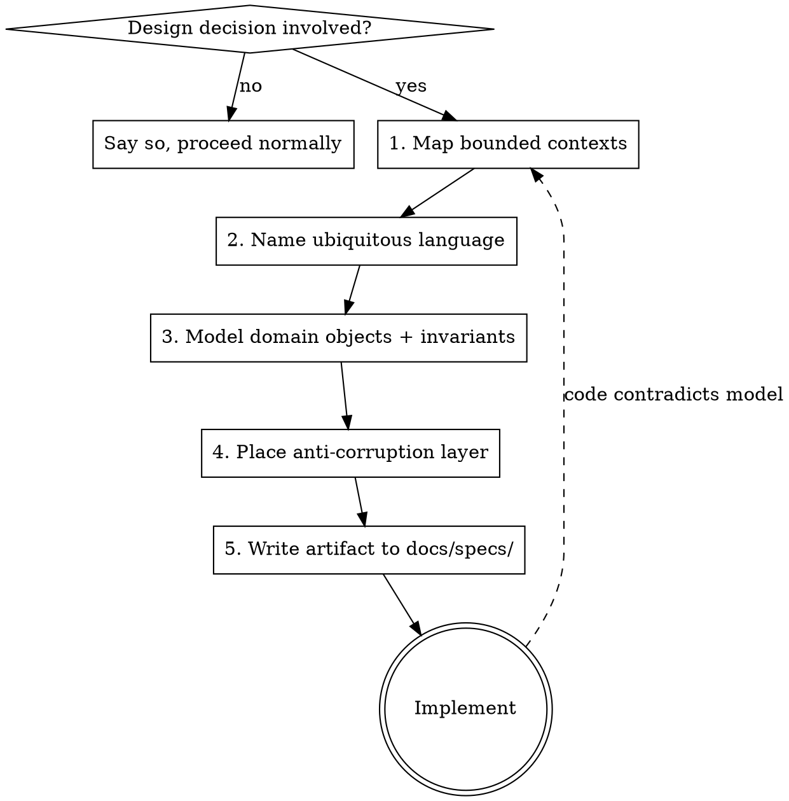

# Domain-Driven Design

## Overview

Design sessions are where unexamined coupling, anemic models and vendor lock-in calcify — the large ones and the small ones alike. DDD makes the boundaries and the domain model explicit *before* code, so the design survives the next dependency swap or scope expansion.

**Core principle:** model the domain first, name the boundaries, classify every domain object (entity or value object), enforce each aggregate's invariants at construction and mutation, keep each context's types free of leaked implementation or vendor types, and translate at the edge. Contexts sized by language, modeling effort concentrated on the core domain, no object that makes nothing explicit. Produce a written artifact before implementation.

This is a discipline skill. The steps are not optional decoration on top of "just write the adapter." Arriving at a reasonable structure without naming the contexts, the language, and the invariants leaves the next person (and the next dependency swap) to rediscover them.

## When to use

Apply DDD to **every architecture or design session, no matter how small**. If the shape of the code is being decided, the skill is on:

- Designing a new feature, subsystem, or service.
- An architectural shift (changing how modules relate, splitting or merging packages).
- Encapsulating, wrapping, or replacing an external dependency (a payment provider, a vendor SDK, a third-party API).
- Restructuring data ownership across modules.
- Any design discussion where types, boundaries, or responsibilities get chosen — even one small type.

The **only opt-out is the user saying so** ("no DDD", "skip the modeling"). Never self-exempt because the change feels small; small designs are where anemic models slip in. Scale the artifact to the change — a small design gets a short artifact, not a skipped one.

Symptoms that you're already in DDD territory:

- Vendor or implementation types (`stripe.Charge`, `sql.DB`, `s3.Client`) appear in signatures or struct fields across more than one module.
- The same word ("order", "stock", "account") means different things in different parts of the code.
- A single change forces edits across several otherwise-unrelated packages.
- Anemic domain model: objects hold data but almost no behavior; every rule enforced (or forgotten) in callers and services.

**Skip it** only for work with no design decision at all — a mechanical bugfix, a config tweak. Say so explicitly when you skip: "no design decision here, no DDD modeling needed."

## The workflow

Work these in order. Do not jump to code until the artifact exists.


```dot
digraph ddd {
    "Design decision involved?" [shape=diamond];
    "Say so, proceed normally" [shape=box];
    "1. Map bounded contexts" [shape=box];
    "2. Name ubiquitous language" [shape=box];
    "3. Model domain objects + invariants" [shape=box];
    "4. Place anti-corruption layer" [shape=box];
    "5. Write artifact to docs/specs/" [shape=box];
    "Implement" [shape=doublecircle];

    "Design decision involved?" -> "Say so, proceed normally" [label="no"];
    "Design decision involved?" -> "1. Map bounded contexts" [label="yes"];
    "1. Map bounded contexts" -> "2. Name ubiquitous language";
    "2. Name ubiquitous language" -> "3. Model domain objects + invariants";
    "3. Model domain objects + invariants" -> "4. Place anti-corruption layer";
    "4. Place anti-corruption layer" -> "5. Write artifact to docs/specs/";
    "5. Write artifact to docs/specs/" -> "Implement";
    "Implement" -> "1. Map bounded contexts" [label="code contradicts model", style=dashed];
}
```

The back edge is real: when implementation contradicts the model, revise the artifact — refactoring toward deeper insight is part of the discipline, not a failure of it.

### 1. Distill the domain, map bounded contexts

First classify each subdomain: **core** (the differentiator — this is where deep modeling investment pays), **supporting**, or **generic** (auth, notifications, commodity billing — buy it, conform to it, or keep the model shallow). Effort follows the classification; full ceremony on a generic subdomain is misdirected, and a conformist relationship is often the *right* answer there.

Then name each context and its responsibility. Draw the relationships: partnership, customer/supplier, conformist, shielded by an anti-corruption layer, or separate ways (no integration at all — the cheapest correct answer more often than it gets picked). Use the `templates/context-map.md` template.

**A context is sized by its language.** It extends exactly as far as the model and its terms stay consistent. Same word, different meaning is a seam — split there, whatever the current schema or team layout says. Don't split where language *and* data are both shared; every extra context is a translation layer and a coordination cost. When the two pressures conflict, language breaks the tie.

### 2. Name the ubiquitous language

List the domain terms each context owns. Flag terms that mean different things in different contexts — that ambiguity is usually the source of the tangle. State which values are *stored* and which are *derived* (storing a derived value is how numbers drift).

The language is crunched *with* the domain expert, not invented solo — here, that's the user. Confirm any term whose meaning you inferred; a wrong meaning pinned into the artifact ships with full ceremony behind it.

### 3. Model domain objects and invariants

Four rules, all mandatory:

**Classify every domain object as an entity or a value object.** No unclassified objects. Entity: identity persists across state changes. Value object: defined entirely by its values, immutable, interchangeable. Write the classification into the artifact — it decides equality, mutability, and lifecycle, so leaving it implicit means deciding it by accident later.

**Every object makes a concept explicit; no object makes nothing explicit.** An object earns its place with an invariant to enforce, an identity to track, or a domain concept that would otherwise hide in a primitive or a flag — an `EmailAddress`, a `Specification`, a domain event. Both failure modes are real. A type per noun in the requirements is sprawl: merge or delete until everything left is load-bearing. But raw `string`/`int64` standing in for domain concepts is *primitive obsession*, the anemic model's cousin — prefer a small value object over a bare primitive; the type carries the meaning and the validation.

**Capture every invariant in a constructor — scoped to its aggregate.** A *true* invariant is one that must hold transactionally, and it lives inside one aggregate: the constructor (or factory, when creation is complex) establishes it and refuses invalid states; every mutating operation preserves it inside the aggregate; no exported fields or setters bypass it. An object that exists is valid — that's the contract. A rule spanning aggregates is *not* a constructor's job: never grow a giant aggregate to make it one (that's the lock-contention, concurrency-conflict failure). Cross-aggregate rules are eventually consistent — one aggregate commits, emits a domain event, the other reacts and reconciles. Rules of the road for the boundary: reference other aggregates **by ID only**, modify **one aggregate per transaction**, integrate between aggregates and contexts **with domain events**.

**The object owns its behavior, not just its data.** An *anemic domain model* is one whose objects contain data but almost no behavior — the rules live in callers and services, and every caller becomes a place an invariant can be forgotten. Any behavior specific to one domain object belongs on that object: the entity enforces its own invariants and exposes the operations that change its state. Domain services exist only for interactions *between* objects — logic that genuinely spans aggregates. A domain service that manipulates one object's state is that object's method in the wrong place. Orchestration — loading aggregates, invoking their behavior, managing transactions — is an *application* service, outside the model, and holds no domain rules at all.

### 4. Place the anti-corruption layer

When wrapping or replacing a dependency, define the boundary that keeps vendor/implementation types out of the domain. The domain defines an interface in its own types; the adapter translates. See `templates/anti-corruption-layer.md` for a Go skeleton and checklist.

### 5. Write the artifact before code

Produce a short ADR plus the context map in `docs/specs/` (or wherever the project already keeps specs — never a tool-named folder). Use `templates/adr.md`. Then implement.

## One concrete example (Go)

Domain owns a provider-neutral type and the interface. The vendor SDK is confined to one adapter package and never leaks.

```go
// package billing — the domain. No vendor types here.

// Money is a value object: defined by its values, immutable, no identity.
// Fields are unexported; NewMoney is the only way in.
type Money struct {
    minor    int64  // amount in minor units; never float
    currency string
}

// NewMoney captures the invariants at construction. A Money that exists
// is valid — callers never re-check.
func NewMoney(minor int64, currency string) (Money, error) {
    if minor < 0 {
        return Money{}, fmt.Errorf("money: negative amount %d", minor)
    }
    if !validCurrency(currency) {
        return Money{}, fmt.Errorf("money: unknown currency %q", currency)
    }
    return Money{minor: minor, currency: currency}, nil
}

// Charge is an entity: ID persists across status changes.
type Charge struct {
    ID     string
    Amount Money
    Status ChargeStatus
}

// PaymentProvider is expressed entirely in domain types.
// Stripe and Adyen each become one implementation.
type PaymentProvider interface {
    CreateCharge(ctx context.Context, req ChargeRequest) (Charge, error)
    Refund(ctx context.Context, chargeID string) error
    VerifyWebhook(payload []byte, sig string) (Event, error)
}
```

```go
// package billing/stripe — the anti-corruption layer.
// The ONLY package allowed to import stripe-go. Deleted when Stripe is gone.
type Provider struct{ client *stripe.Client }

func (p *Provider) CreateCharge(ctx context.Context, req billing.ChargeRequest) (billing.Charge, error) {
    sc, err := p.client.Charges.New(toStripeParams(req)) // translate IN
    if err != nil {
        return billing.Charge{}, mapStripeErr(err)       // translate errors too
    }
    return toDomainCharge(sc), nil                        // translate OUT
}
```

Order, subscription, and reporting code import `billing` only — never `billing/stripe`. After the boundary exists, `grep stripe.` returns hits only inside the adapter.

## Common mistakes

| Mistake | Fix |
|---------|-----|
| "I'll just write the adapter" — skips contexts/language/invariants | The adapter is step 4 of 5. Name the contexts and invariants first or the boundary is in the wrong place. |
| Anemic domain model: objects hold data but almost no behavior | Object-specific behavior goes on the object; the entity owns its invariants. Constructors validate; methods mutate. Domain services only for interactions between objects. |
| Object constructible in an invalid state | Constructor or factory validates and refuses. Born valid or not born; no bypass via exported fields or setters. |
| Domain object with no declared kind | Classify it: entity (identity persists) or value object (values only, immutable). Every object, no exceptions. |
| Domain object sprawl — a type per noun in the requirements | An object earns its place by making a concept explicit: invariant, identity, or a concept hiding in a primitive. Otherwise it's a field. |
| Primitive obsession — domain concepts as raw strings and ints | Wrap in a value object. The type carries the meaning and the validation. |
| One giant aggregate so every rule is constructor-enforceable | True invariants only within one aggregate. Cross-aggregate rules go eventually consistent: commit one, emit an event, reconcile. |
| Direct object references or multi-aggregate transactions | Reference other aggregates by ID only; modify one aggregate per transaction; events between. |
| Context sprawl — a bounded context per team, module, or noun | A context earns its boundary with its own language and data. Sharing both → one context. |
| Merging contexts that speak different languages | Same word, different meaning is a seam. Split there; language outranks shared data or convenience. |
| Deep-modeling a generic subdomain | Distill first. Core gets the investment; generic gets bought, conformed to, or kept shallow. |
| Vendor types in domain signatures | Domain interface uses domain types only. Translate in the adapter. |
| Storing a derived value (e.g. `available`) | Store the inputs (`on_hand`, `reserved`), compute the derived value. |
| Invariant checks scattered across callers | Move them inside the aggregate. One enforcement point. |
| Big-bang swap of code + data + dependency at once | Phase it: introduce the boundary keeping the old impl, then swap behind it, then decommission. |
| Spec written under a tool-named folder | Artifacts go in `docs/specs/`, named by content, not by tool. |

## Red flags — stop and model first

- About to add a vendor type to a function signature outside its adapter package.
- About to start design work by editing implementation directly.
- About to write a domain type with exported fields and no constructor.
- "I'll validate in the service layer" / "callers will check before constructing."
- A domain concept riding around as a raw string or int.
- A new domain object that makes nothing explicit — no invariant, no identity, no hidden concept.
- A domain object nobody has classified as entity or value object.
- A transaction about to touch two aggregates, or an aggregate holding a direct reference to another.
- Growing an aggregate so a cross-aggregate rule fits in one constructor.
- Splitting a bounded context when neither side owns distinct language or data — or merging two that speak different languages.
- "This design is too small for the ceremony" — only the user can say that.

All of these mean: run the five steps and write the artifact first.

## Reference

`references/building-blocks.md` — entity vs value object, aggregate, repository, domain event, ACL, context-mapping relationship types. Read it when you need the vocabulary precisely.
