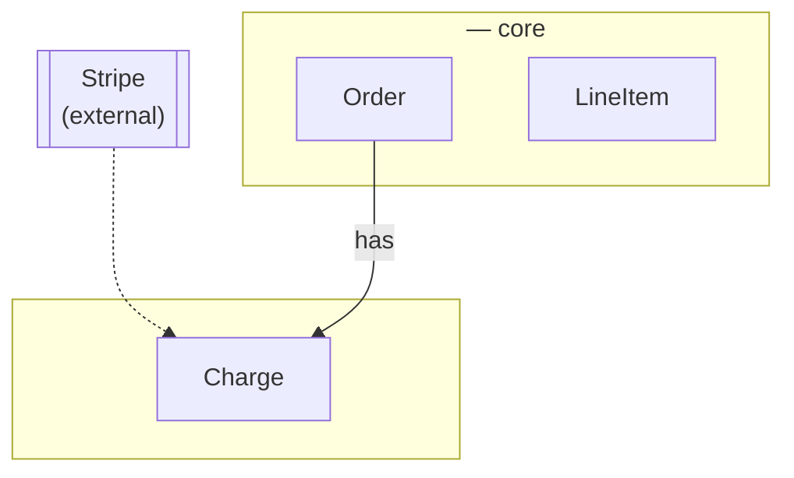
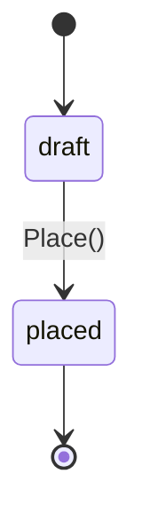
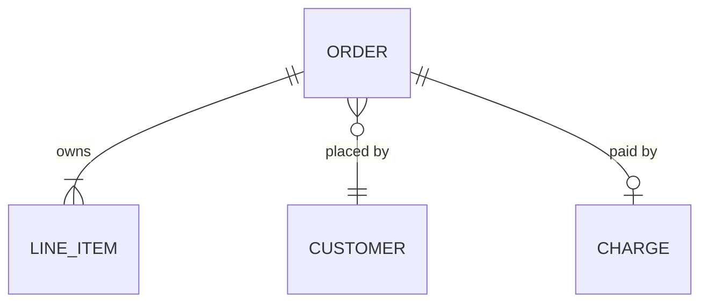
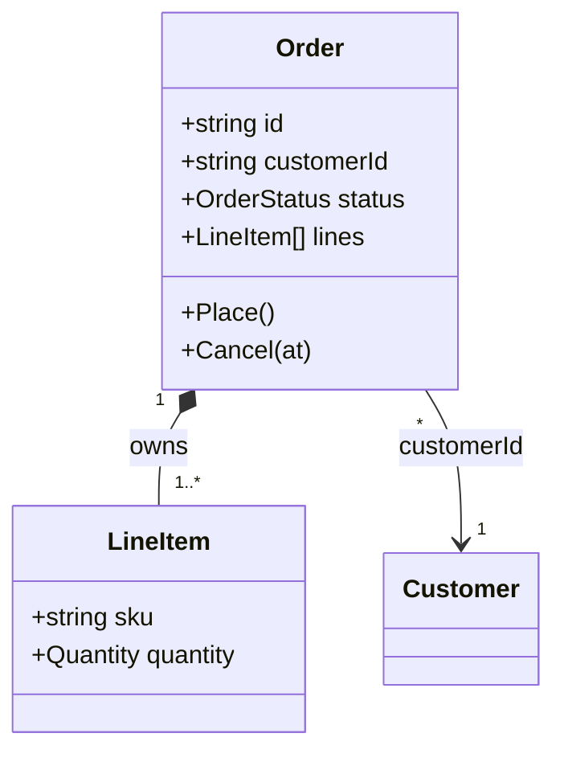

# <Domain> domain model

> The objects, their fields, what owns what, and how they relate. Nothing else:
> no endpoints, no schema, no events. Decisions go in the ADR, language goes in
> the context map. Delete this quote block and the examples before committing.

## Reading this

**Kind.** *Entity* has identity that survives its field values changing. *Value*
is defined entirely by its values, is immutable, and two with equal fields are
the same thing. *Enumeration* is a closed set of named values.

**Root** marks an aggregate root: the only object outside code reaches into, and
the boundary a change commits inside.

**A type exists only when it carries an invariant beyond existing.** An
identifier is a string. `Email` is a type because it has a shape; `OrderId` is
not, because "non-empty" is not a rule worth a constructor.

**Optional** means the field may be absent, and the table says what absence
means. Nothing here is nullable by accident.

## Contexts

<One line on what crosses between contexts, and what does not.>

## Objects

> One block per object. Every field, no exceptions.

### <Context name>

**`Order`** — entity, root. <One line: what it is.>

| Field | Type | Optional | Meaning |
|---|---|---|---|
| `id` | string | no | |
| `customerId` | string | no | `Customer.id`. Immutable |
| `status` | `OrderStatus` | no | |
| `placedAt` | Timestamp | no | |
| `cancelledAt` | Timestamp | **yes** | Absent means never cancelled |
| `lines` | list of `LineItem` | no | Owned. At least one |

Invariants: <what the constructor refuses, and what every mutation preserves>.

**`OrderStatus`** — enumeration.

| Value | Means |
|---|---|
| `draft` | |
| `placed` | |

Anything not drawn is refused by the aggregate.

**`LineItem`** — entity, local to `Order`. <What it is.>

| Field | Type | Optional | Meaning |
|---|---|---|---|
| `sku` | string | no | Identity within the order |
| `quantity` | `Quantity` | no | |

## Ownership

What each root owns outright: created with it, removed with it, never referenced
from another aggregate.

| Root | Owns | Names by id |
|---|---|---|
| `Order` | `LineItem` | `customerId` |
| `Customer` | — | — |

<Objects owned by nothing — derived values, append-only streams — listed here
with why.>

## Relationships

### has-a

Composition. The part dies with the whole.

| Whole | Part | Cardinality | Notes |
|---|---|---|---|
| `Order` | `LineItem` | **1 to n**, n ≥ 1 | The lower bound is the invariant |

### references, by id

Association across an aggregate boundary. Neither side dies with the other.

| From | To | Cardinality | Notes |
|---|---|---|---|
| `Order` | `Customer` | **n to 1** | |
| `Order` | `Charge` | **1 to 0..1** | Absent until payment is attempted |

### is-a

State whether each is a **sum** (exactly one of a closed set) or **inheritance**
(shared behavior specialized). Most domain is-a is a sum. If there are none, say
so and say why — variants that differ only in permissions are a role field, not
a subtype.

| Supertype | Subtypes | Sum or inheritance | Notes |
|---|---|---|---|
| | | | |

### derived-from

| Value | Derived from | Notes |
|---|---|---|
| `OrderTotal` | `Order.lines` | Never stored |

### Everything at once

### Structure

Solid diamond is ownership, plain arrow is a reference by id, dotted is derived.

## What each root can do

Behavior lives on the object, not in a service. An empty column here is anemia.

| Root | Methods |
|---|---|
| `Order` | `Place()`, `Cancel(at)`, `AddLine(sku, qty)`, `Total()` |

<Any domain service, and the cross-aggregate rule it owns. "None" is a fine
answer and a better one than a service invented to have one.>

## Inferred, not confirmed

> Everything unmarked reads as settled and gets built on. List what nobody was
> actually asked about.

- <field or object> — <what was assumed>
