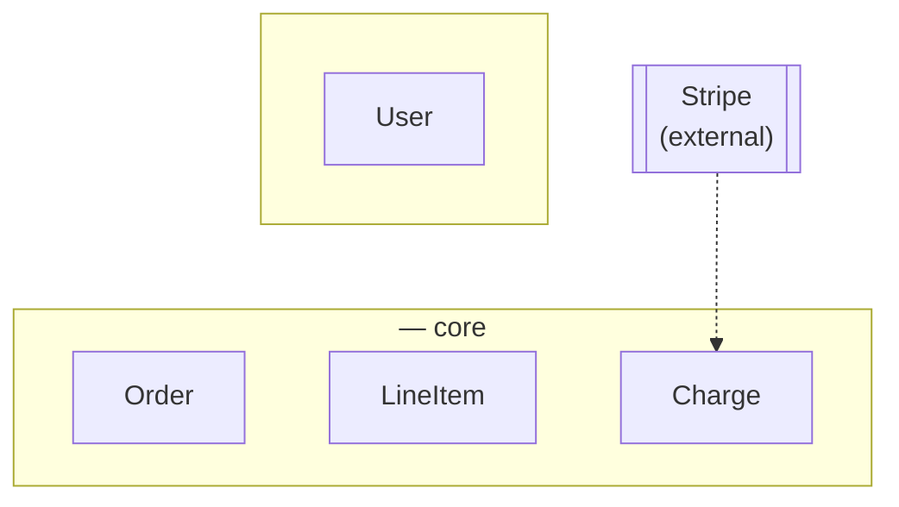
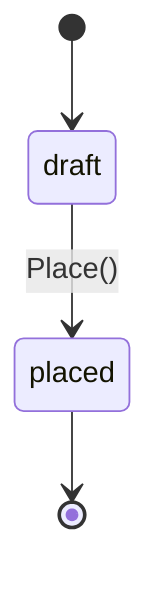
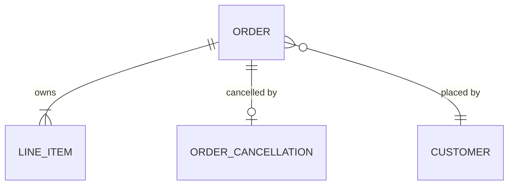

# <Domain> domain model

> The objects. Everything about an object lives in its own section: fields,
> behaviors, relationships, states. No endpoints, no schema, no events —
> decisions go in the ADR, language goes in the context map. Delete this quote
> block and the examples before committing.
>
> Nothing is optional unless absence is itself a recorded fact with a stated
> meaning. In a record or an audit, a thing that went wrong is recorded
> explicitly — an outcome enum, evidence — never an empty field.

## Contexts

<One line on what crosses between contexts, and what does not.>

## Order

Entity, aggregate root. <One line: what it is in the domain.>

### Fields

Every field. No exceptions.

| Field | Type | Meaning |
|---|---|---|
| `id` | string | |
| `customerId` | string | `Customer.id`. Immutable |
| `status` | `OrderStatus` | |
| `placedAt` | Timestamp | |

<A later fact — cancellation, closure, revocation, completion — is NOT a
nullable column here. It gets its own object and its own table; absence of
the row is the state. Say so where a reader would expect the column:>

Cancellation is not a field. A cancelled order has an `OrderCancellation`
row; an order without one is live.

### Behaviors

`Place()`, `AddLine(sku, qty)`, `Total()`. <What the object does. An empty
list here is anemia.>

### Invariants

Real rules, not restatements of the field table. "`id` is immutable" is not
an invariant worth writing; "at least one line at all times, so removing the
last is refused" is.

- <what the constructor refuses>
- <what every mutation preserves>

### States

Anything not drawn is refused by the aggregate.

### Relationships

| With | Kind | Cardinality |
|---|---|---|
| `LineItem` | has-a (owned) | 1 to n, n ≥ 1 |
| `Customer` | references | n to 1 |
| `OrderCancellation` | has-a (owned) | 1 to 0..1 |

Kind is `has-a` (composition, the part dies with the whole), `references`
(by id, across an aggregate boundary), `is-a` (say sum or inheritance; most
domain is-a is a sum, and variants differing only in permissions are a role
field), or `derived-from`.

## OrderCancellation

Value object, owned by `Order`, stored as its own table
(`order_cancellations`). Exists exactly when the order is cancelled.

### Fields

| Field | Type | Meaning |
|---|---|---|
| `orderId` | string | |
| `cancelledAt` | Timestamp | |

### Relationships

| With | Kind | Cardinality |
|---|---|---|
| `Order` | owned by | 0..1 to 1 |

## LineItem

Entity, owned by `Order`. <What it is.>

### Fields

| Field | Type | Meaning |
|---|---|---|
| `sku` | string | Identity within the order |
| `quantity` | `Quantity` | |

### Relationships

| With | Kind | Cardinality |
|---|---|---|
| `Order` | owned by | n to 1 |

## OrderStatus

Enumeration.

| Value | Means |
|---|---|
| `draft` | |
| `placed` | |

## Everything at once

## Open, not assumed

> Everything unmarked reads as settled and gets built on. List what nobody
> was actually asked about, as questions rather than filled-in guesses.

- <the thing nobody decided> — <what is unknown about it>
